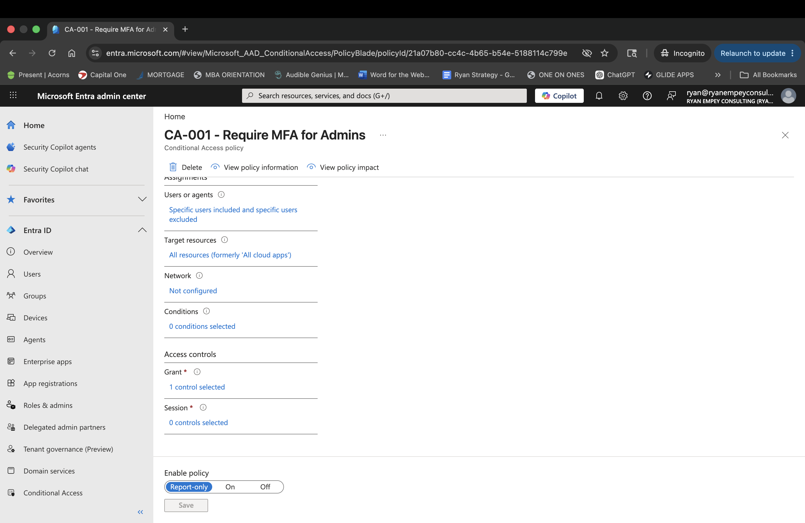
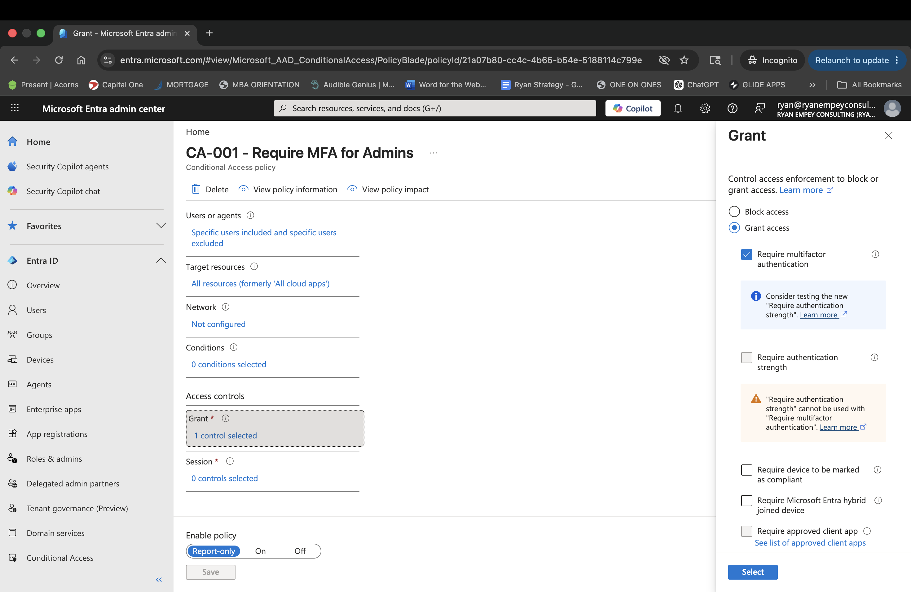

# CA-001 – Require MFA for Administrators

## Objective

Protect privileged administrator accounts from credential theft and unauthorized access.

## Business Justification

Administrative accounts represent the highest risk identities in the tenant.

Compromise of an administrator account could result in:

- Unauthorized access to patient systems
- Security policy modification
- Identity privilege escalation
- Service disruption

## Assignments

### Users

Included:

- Global Administrators
- Security Administrators
- Conditional Access Administrators

Excluded:

- BreakGlass01
- BreakGlass02

## Cloud Apps

All cloud applications

## Conditions

None

## Access Controls

Grant Access:

- Require Multifactor Authentication

## Policy State

Report-only

## Expected Outcome

All privileged administrators must successfully complete MFA before accessing Microsoft Entra resources.

## Screenshots

### Policy Overview

### Grant Controls

