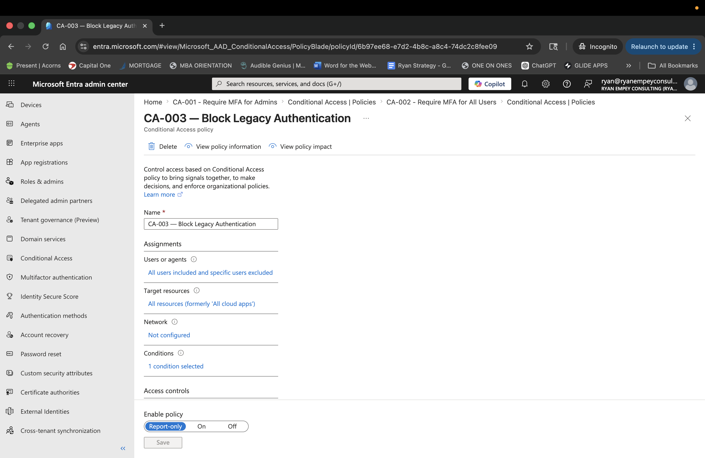
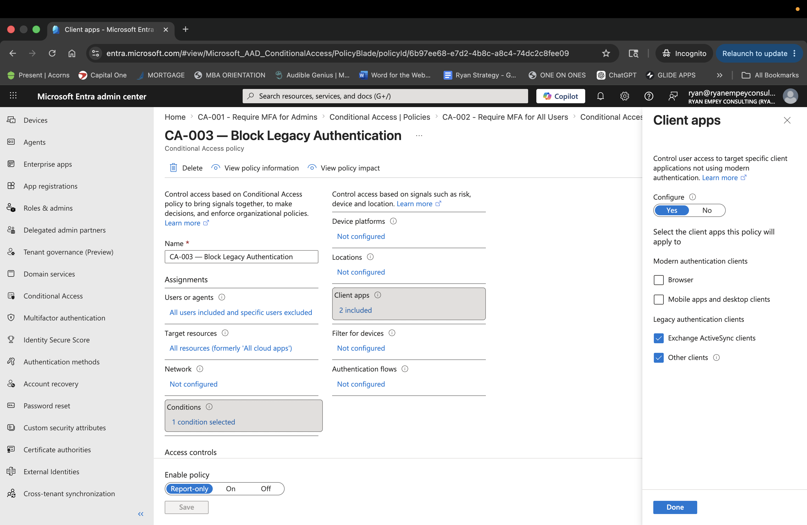

# CA-003 – Block Legacy Authentication

## Objective

Prevent legacy authentication protocols from accessing Microsoft Entra ID resources.

## Business Justification

Legacy authentication protocols do not support modern security controls such as Multifactor Authentication (MFA).

These protocols are commonly targeted by attackers because they bypass many modern identity protections.

Examples include:

- POP3
- IMAP
- SMTP Authentication
- Exchange ActiveSync
- Older Office Clients

## Security Risk

Legacy authentication increases the likelihood of:

- Password spraying attacks
- Credential stuffing
- Brute force attacks
- Unauthorized mailbox access

## Assignments

### Users

Included:

- All Users

Excluded:

- BreakGlass01
- BreakGlass02

## Cloud Apps

All Cloud Apps

## Conditions

### Client Apps

Included:

- Exchange ActiveSync
- Other Legacy Authentication Clients

## Access Controls

Block Access

## Policy State

Report-only

## Expected Outcome

All authentication attempts using legacy protocols are blocked.

Users must authenticate using modern authentication methods that support MFA and Conditional Access controls.

## Healthcare Considerations

Healthcare organizations frequently use older clinical applications and medical devices.

Policies should initially be deployed in Report-only mode to identify affected systems before enforcement.

## Screenshots

### Policy Overview

### Client Applications Configuration

